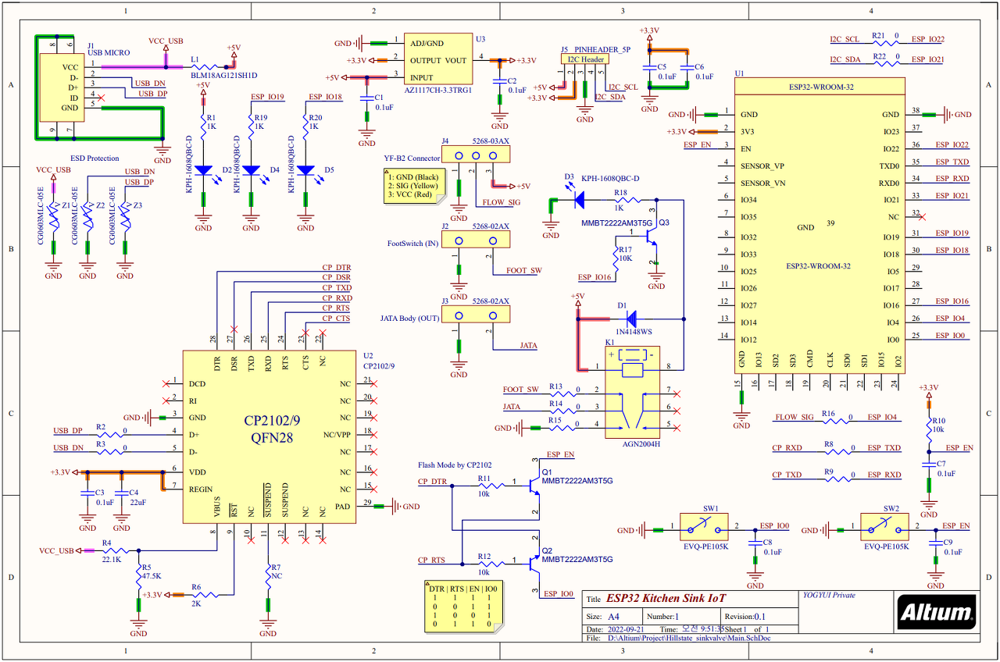
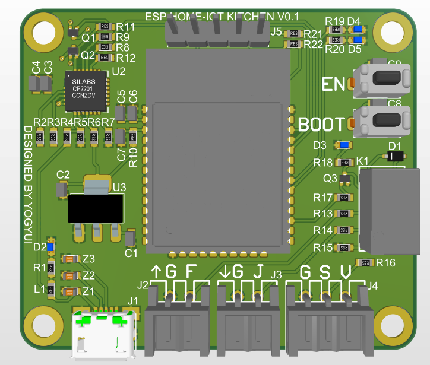
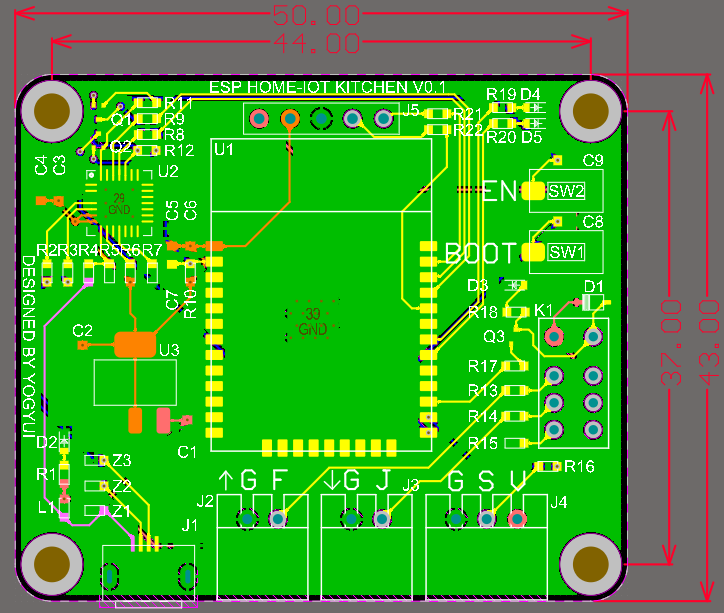

# esp32-sink-iot
주방 싱크대 절수 페달 홈네트워크 연동 소스코드 (ESP32) <br>
- Hall Effect 유량계를 사용하여 싱크대 수전에 물이 흐르고 있는지 여부 파악
- MQTT 프로토콜을 통해 Homebridge 및 Home Assistant 홈 IoT 플랫폼과 연동
- 일정 시간 물이 흐르면 자동으로 수전 밸브 차단 기능 <br>
(로봇청소기 등에 의한 원치 않는 수전 작동 방지)

HW/SW Restrictions
---
1. JATA 풋터치식 전자수전밸브 [JATA-2200](http://www.jata.co.kr/default/02/01.php?com_board_basic=read_form&com_board_idx=12&&com_board_search_code=&com_board_search_value1=&com_board_search_value2=&com_board_page=&&com_board_id=21&&com_board_id=21)
2. 유량계: Seeed Studio [YF-B2](https://www.seeedstudio.com/Water-Flow-Sensor-YF-B2-p-2879.html)
3. 개발환경: [ESP-IDF v4.4.2](https://docs.espressif.com/projects/esp-idf/en/v4.4.2/esp32/get-started/index.html) + Visual Studio Code

⚠MQTT broker 정보는 [defines.h](https://github.com/YOGYUI/esp32-sink-iot/blob/main/main/include/defines.h) 
에 하드코딩되어 있다. 적절한 값으로 바꾼 후 빌드 및 플래시해야 한다. ️⚠️<br>
(파라미터화 및 외부 앱을 통한 변경 기능 추가 계획 없음)
```c
#define MQTT_BROKER_URI         "mqtt://broker_address"
#define MQTT_BROKER_PORT        1883
#define MQTT_BROKER_USERNAME    "broker_auth_id"
#define MQTT_BROKER_PASSWORD    "broker_auth_password"
```

Board Schematics
---
 <br><br>
GPIO 핀맵 
- IO4: 입력, YF-B2 유량계 펄스 신호
- IO16: 출력, 릴레이(1N4148) 동작<br>
  릴레이 Common: JATA 컨트롤박스 제어 신호<br>
  릴레이 NC: JATA 풋스위치 신호<br>
  릴레이 NO: GND
- IO18: 출력, Wi-Fi 연결 여부 표시 LED
- IO19: 출력, 유량감지 표시 LED
- IO21, 22: I2C, 14 segemnt LED Display

PCB Design
---
 <br>
 <br>
- dimension: 가로 50mm X 세로 43mm

Core ESP Components
---
- GPIO
- Wi-Fi
- MQTT
- BLE (Wi-Fi Provisioning)
- Pulse Counter
- PWM
- Timer
- I2C
- SNTP
- OTA (not yet implemented)

MQTT Commands
---
publish, subscribe를 위한 topic은 모두 [defines.h](https://github.com/YOGYUI/esp32-sink-iot/blob/main/main/include/defines.h) 
에 정의되어 있다.
```c
#define MQTT_PUBLISH_TOPIC_DEVICE       "home/hillstate/sinkvalve/state"
#define MQTT_SUBSCRIBE_TOPIC_DEVICE     "home/hillstate/sinkvalve/command"
```
명령 payload는 다음과 같은 json 구조를 가진다
 ```json
{
  "state": 1,
  "auto_off": 1,
  "off_time": 5
}
```
- state: 싱크대 수전 밸브 가동(1), 정지(0)
- auto_off: 밸브 가동 후 일정 시간 뒤 자동 정지 기능 활성화 여부 (0 or 1)
- off_time: 밸브 가동 후 자동 정지될 때까지의 시간 (단위: 초)

Reference URLs
---
[힐스테이트 광교산::싱크대 절수페달 IoT 연동하기 - (1)](https://yogyui.tistory.com/392) <br>
[힐스테이트 광교산::싱크대 절수페달 IoT 연동하기 - (2)](https://yogyui.tistory.com/393) <br>
[힐스테이트 광교산::싱크대 절수페달 IoT 연동하기 - (3)](https://yogyui.tistory.com/394) <br>
[힐스테이트 광교산::싱크대 절수페달 IoT 연동하기 - Final](https://yogyui.tistory.com/397) <br>